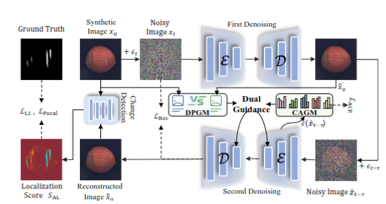

# DiffusionAD




**Classification and Calibration: Dual-Guidance Diffusion Model for Mitigating Reconstruction Hallucinations in    Multi-Class Anomaly Detection**

*Yuan Zhao*

[Paper link]( )

##  Introduction
DGDM is  novel diffusion-based methods. It mitigates reconstruction hallucinations in multi-class anomaly detection by prototype and class-aware guidance.
 
## Get Started 

### Environment 
```bash
pip install -r requirements.txt
```

### Data

#### MvTec-AD
Download the dataset from [here](https://www.mvtec.com/company/research/datasets/mvtec-ad/).

#### VisA
Download the dataset from [here](https://amazon-visual-anomaly.s3.us-west-2.amazonaws.com/VisA_20220922.tar).


```

MVTec-AD
|-- carpet
|-----|----- thresh
|-----|----- ground_truth
|-----|----- test
|-----|--------|------ good
|-----|--------|------ ...
|-----|----- train
|-----|--------|------ good
|-- cable
|-----|----- DISthresh
|-----|----- ground_truth
|-----|----- test
|-----|--------|------ good
|-----|--------|------ ...
|-----|----- train
|-----|--------|------ good

VisA
|-- candle
|-----|----- DISthresh
|-----|----- ground_truth
|-----|----- test
|-----|--------|------ good
|-----|--------|------ bad
|-----|----- train
|-----|--------|------ good
|-- capsules
|-- ...

```


## Inference
Please specify the dataset path MVTec-AD and checkpoints path, To perform inference with checkpoints, please run:
```bash
python main.py
```

## 📁 checkpoints Links

| Dataset   | Google Drive | Baidu Drive     |
|-----------|--------------|-----------------|
| MVTec-AD  | [Download]( ) | Download (Soon) |
